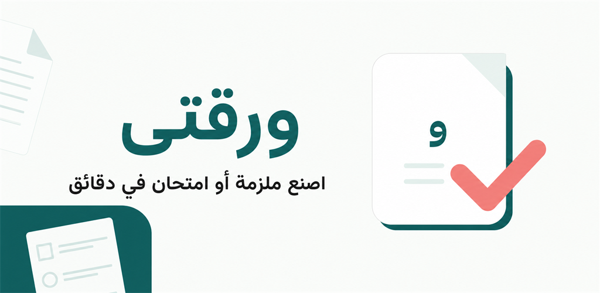

<div align="center">
  

  # Waraqty | ورقتي

  ### Turn a question bank into a print-ready booklet or exam in minutes.

  An Arabic-first Flutter app built for Egyptian primary-school teachers.

  <a href="https://play.google.com/store/apps/details?id=com.marwan.waraqty">
    
  </a>
</div>



## The Problem

Preparing a good worksheet or exam is repetitive work. Teachers often spend time searching for suitable questions, balancing question types, formatting the paper, creating an answer key, and making the final document ready to print.

Waraqty turns that workflow into a guided mobile experience.

## The Solution

A teacher selects a grade, chooses a document type, and builds the paper from a structured question bank. Waraqty handles organization, formatting, answer-key generation, PDF preview, local saving, and sharing.

The first release focuses on Egyptian Social Studies for grades 4, 5, and 6.

## What Waraqty Delivers

- **1,200 questions** available locally across three grade levels.
- **Eight question categories:** multiple choice, complete, true/false, explain, define, essay, compare, and consequences.
- **Flexible selection controls:** limits per category, unlimited mode, select all, and clear selection.
- **Editable paper structure:** selected sections can be reviewed, removed, and reordered.
- **Two document workflows:** booklets with optional answers, and exams with a separate answer key.
- **Six PDF templates:** three booklet designs and three exam designs inspired by Egyptian school papers.
- **Document customization:** teacher or school details, font size, answer lines, and paper metadata.
- **Complete PDF workflow:** preview, save to an organized Downloads folder, and share from the device.
- **Local-first experience:** the question bank works offline and no account is required.
- **Privacy-aware monetization:** adaptive banner and interstitial ads with Google UMP consent support.

## From Questions to PDF

```text
Grade
  -> Subject
  -> Booklet or Exam
  -> Question Categories
  -> Question Selection
  -> Section Review and Reordering
  -> Document Details and Template
  -> PDF Preview
  -> Save and Share
```

This flow preserves the teacher's selected questions even when switching between booklet and exam modes.

## Product Decisions

### Fast without a backend

The first version ships its structured question bank locally. Teachers can browse questions and generate documents without waiting for network requests, while repository and use-case boundaries keep the data source replaceable for a future Supabase migration.

### State belongs outside the UI

Selection limits, chosen questions, document sections, paper details, PDF generation, and ad lifecycle state are managed with Cubit rather than widget-local state. This keeps screens focused on rendering and user interaction.

### PDF output is a core feature

PDF generation is handled on-device with separate services for Egyptian paper layouts and file storage. The app supports booklet answers, separate exam answer keys, multiple templates, previewing, saving, and native sharing.

### Arabic is the default experience

The interface is designed around RTL navigation, Arabic typography, and responsive layouts instead of treating Arabic as a translated secondary language.

## Architecture

Waraqty uses feature-first Clean Architecture:

```text
lib/
|-- app/                         # App shell, directionality, and system UI
|-- core/
|   |-- ads/                     # AdMob and banner state management
|   |-- constants/               # Routes, strings, assets, and constants
|   |-- enums/                   # Shared domain enums
|   |-- routing/                 # GoRouter configuration
|   |-- theme/                   # Colors, typography, spacing, and theme
|   `-- widgets/                 # Reusable app-wide widgets
`-- features/
    |-- onboarding/
    |-- paper_setup/
    |-- question_bank/
    `-- document_builder/
        |-- data/
        |-- domain/
        `-- presentation/
```

Each feature separates presentation, domain, and data responsibilities. Repositories isolate data access, use cases express application actions, and Cubits expose predictable UI state.

## Engineering Stack

| Area | Technology |
| --- | --- |
| UI | Flutter, Material |
| State management | Cubit / flutter_bloc, Equatable |
| Navigation | GoRouter |
| Architecture | Feature-first Clean Architecture |
| Responsive UI | flutter_screenutil |
| Local preferences | shared_preferences |
| PDF generation | pdf, printing |
| Icons | lucide_icons_flutter |
| Ads and consent | google_mobile_ads, Google UMP |
| Branding | flutter_launcher_icons, flutter_native_splash |
| Arabic font | IBM Plex Sans Arabic |

## Privacy

Waraqty does not require an account. Question selections, preferences, and generated PDFs remain on the user's device. Google AdMob may process advertising-related device data according to user consent and Google's policies.

- [Privacy Policy](https://marwan28.github.io/privacy.html)
- [app-ads.txt](https://marwan28.github.io/app-ads.txt)

## Next

- Add more Egyptian school subjects and grade levels.
- Move the question bank to Supabase.
- Add teacher accounts and cloud synchronization.
- Support teacher-submitted questions and moderation.
- Add smart question recommendations.
- Add saved document history and reusable presets.

## Author

Designed and developed by [Marwan Abdelwahab](https://github.com/Marwan28).
